# Projeto `Software Dungeon`

## Estrutura de Arquivos e Pastas
```
├── README.md          <- apresentação do projeto
│
├── data               <- dados usados pelo jogo (se houver)
│
├── notebooks          <- Jupyter notebooks ou equivalentes
│
├── diagramas          <- diagramas usados para apresentação
│
├── src                <- projeto em Java (preferencialmente projeto no Eclipse)
│   │
│   ├── src            <- arquivos-fonte do projeto (.java)
│   │
│   ├── bin            <- arquivos em bytecode (.class)
│   │
│   └── README.md      <- instruções básicas de instalação/execução
│
└── assets             <- mídias usadas no projeto
```
## Descrição do Projeto:
O Projeto Software Dungeon consiste em um Role Playing Game (RPG) de turnos com uma temática relacionada a área de TI. Para isso, buscamos desenvolver um jogo que combine as campanhas épicas dos RPGs com classes e habilidades de personagens relacionados a área de TI.

## Equipe
* `João Miguel de Oliveira Guimarães` - `174358`
* `José Felipe Theodoro` - `219081`

## Vídeos do Projeto
### Vídeo da Prévia
Clique [aqui](https://drive.google.com/file/d/1qhYWc6KVMfF58pXKRRS31AP4sjog4pJ3/view?usp=sharing) para acessar o vídeo da prévia.

### Vídeo do Jogo
Clique [aqui](https://drive.google.com/file/d/1qljYAb-wx3RsP0gWZjCVfgNo242PD7Zw/view?usp=sharing) para acessar o vídeo da prévia.

## Slides do Projeto
### Slides da Prévia
Clique [aqui](https://docs.google.com/presentation/d/1MpBTCWQWIdH_MCYp_qSrFiiznRZbK0I9ln1lg0OSggU/edit?usp=sharing) para acessar os slides da prévia.

### Slides da Apresentação Final (Mudar Link)
Clique [aqui](https://docs.google.com/presentation/d/1tTTdGfERlyhSzlPiHCvdJbanNxaQn2I93MoUsIdnrng/edit?ts=60d902b0#slide=id.ge147bd0f1d_1_48) para acessar os slides da prévia.

## Relatório de Evolução

Assim como visto nos slides da apresentação optamos por um modelo de composites, uma vez que esse modelo favorecia a expansão do jogo pela facilidade de adicionar as *Entidades* e um visual dinâmico sem o uso de Threads utilizando um **gameloop**. Contudo, ainda houveram tropeços com o funcionamento de certas estruturas do Java similares aos que apareceriam com o uso dos Threads. Aprendemos que certas estruturas, como `ArrayList`, não podem ser alteradas se no momento da ação estamos iterando sobre a estrutura. Para solucionar esse problema, passamos a agendar ações tais quais a remoção de entidades de forma que estas eram realizadas no ciclo seguinte a solicitação.

Além disso, em discussões iniciais apresentamos o `SceneBuilder` que tinha como funcao construir os composites que formam Cena. Contudo, na grande maioria da cenas, com excecao de `GameScene`, eles nao eram necessarios. Por isso, simplificamos a montagem das cenas e o substituimos por `DungeonBuilder`, `EnemyBuilder` etc

## Destaques de código
### Caminhos na Dungeon e Algoritmo A*
Uma operação importante em nosso jogo era determinar se entre duas posições `source` e `target` da `Dungeon` havia um caminho. Para isso, implementamos o algoritmo A* (link) sobre o filtro de uma interface `IPathfinder` permitindo maior generalidade na resolução do problema.

```Java
public class Dungeon extends StaticEntity implements IDungeon {
    public void connectPathfinder(IPathfinder pathFinder) {
		this.pathFinder = pathFinder;
	}
}
```

Além disso, é interessante analisar detalhes da implementação desse algorítmo. É necessária uma fila de prioridades para seu funcionamento. Dessa forma, aproveitamos da interface `Comparator` do Java para obter uma fila adequada a nossos propósitos
```Java
public class NodeComparator implements Comparator<Node> {

	@Override
	public int compare(Node o1, Node o2) {
		if (o1.getFCost() > o2.getFCost())
			return 1;
		else if (o1.getFCost() < o2.getFCost())
			return -1;
		
		return 0;
	}
}

public class AStar implements IPathfinder {
    public ArrayList<int[]> findPath(int[] source, int[] target, IDungeon dg) {
        PriorityQueue<Node> fPrio = new PriorityQueue<Node>(10, new NodeComparator());
        ...
        return caminho;
    }
}
```

## Destaques de Pattern
### Construção dos Heróis e conectando Animações
Com intuito de generalizar a construçãos dos heróis utilizamos do *Factory Patter*. A partir da a Classe `HeroBuilder`, utilizamos o método `buildHero` para obter um Herói.

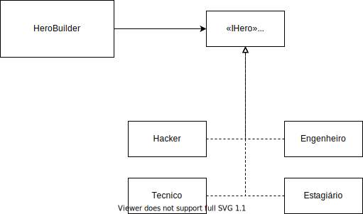

```Java
public static Hero buildHero(Assets gameAssets, String hero) {
    Hero jogador = null;
	IAnimation anim = new Animation();
    ...
    jogador.connectAnimation("idle");
    ...
    return jogador;
}
```

Vale ainda notar que durante a construção mais de uma animação era conectada ao Herói, como "idle" e "atk", e esse eram facilmente selecionadas no momento da renderização por meio de um atributo do herói chamado `state` (String), cujo valor coincide com o utilizado no momento da conexão.

### Renderização do componentes
Seguindo as batidas de um `Clock`, os componentes visuais eram renderizados a uma taxa de 60 fps (Frames Por Segundo) de forma simples utilizando o *Composite Pattern*. Basta utilizar o método `render(Graphics2D g)` de uma entidade, como a `Dungeon`. Ao utilizar o método a entidade renderiza seu conteúdo e repassa o comando para todos seus filhos. Seus filhos realizam o mesmo processo até que em um momento alcançamos as folhas. Um exemplo disso é a `Cell`, entidade nó contida dentro da `Dungeon`.

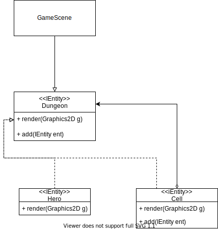

```Java
public class Cell extends StaticEntity implements IEntity {
    ...
    @Override
	public void render(Graphics2D g) {
		Sprite text = animations.get(state).getCurrentFrame();
		g.drawImage(text.getTexture(), x * 32, y * 32, text.getSizeX(), text.getSizeY(), null);
		
		for (IEntity ent : entitys) {
			ent.render(g);
		}	
	}
```

## Conclusões e Trabalhos Futuros
Dessa forma, concluímos o projeto com um resultado satisfatório e novos aprendizados, especialmente sobre *Patterns*. Por questões de tempo, não foi possível implementar os ataques especiais. Então, para o futuro podemos completar esse objetivo utilizando o *Factory Pattern* para conectar os ataques especiais a cada héroi. Além disso, podemos aproveitar também do mesmo patter para conectar formas distintas de IA aos Inimigos e assim melhorar a jogabilidade.

## Documentação dos Componentes
## Diagramas
### Diagrama Geral do Projeto
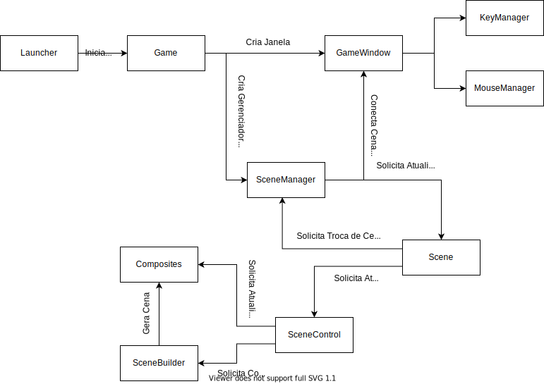

Para o desenvolvimento do projeto nos fundamentamos no padrão de composites. O Componente game interege com uma Janela e com um `SceneManager` de tal forma que solicita ao último a renderiação da `Scene` atual no display. Uma `Scene` agrupa os componentes visuais para renderização, tais quais `JButton`, `JPanel` e etc. Além disso, esta também apresenta uma estrutura de controle para gerenciar os eventos que nela ocorrem. Vale ainda mencionar a `GameScene`, a `Scene` principal. Nela encontram-se a `Dungeon` e os outros composites que são gerenciados pelo controlador e atualizados a cada ciclo do *Game Loop*.

### Diagrama Geral de Componentes
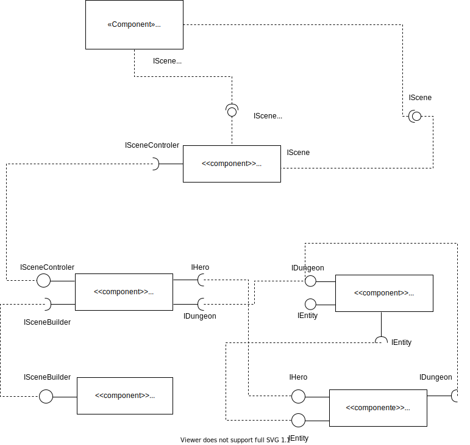

## Componentes
### `SceneManager`

O Componente `SceneManager` é responsável por organizar as Cenas que serão renderizados na tela em um único componente. Além disso, é responsável pela  inserir e remover as cenas da janela principal em runtime.

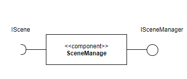

**Ficha Técnica:**
|Item      |Detalhamento             |
|:---------|:------------------------|
|Classe    |`mc322.game.scenes.Scene`|
|Autores   |`João Miguel`     |
|Interfaces|`ISceneManager`                 |

**Interfaces:**

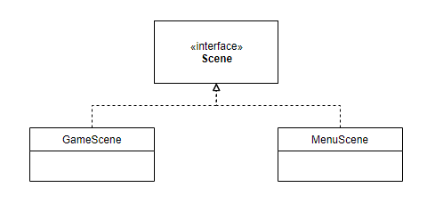

### `Scene`

O Componente `Scene` é responsável por organizar os conteúdos que serão renderizados na tela em um único componente que pode ser adicionado e removido da janela principal em runtime.


**Ficha Técnica:**
|Item      |Detalhamento             |
|:---------|:------------------------|
|Classe    |`mc322.game.scenes.Scene`|
|Autores   |`João Miguel e José`     |
|Interfaces|`IScene`                 |

**Interfaces:**


### `Dungeon`
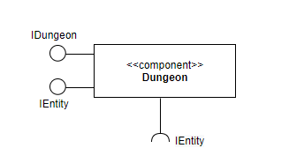

**Ficha Técnica:**
|Item      |Detalhamento                          |
|:---------|:-------------------------------------|
|Classe    |`mc322.game.composites.Dungeon`       |
|Autores   |`João Miguel e José`                |
|Interfaces|`IDungeon`, `IEntity`                 |

**Interfaces**

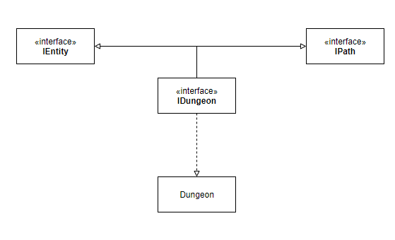

### `Hero`
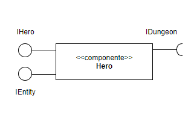

**Ficha Técnica:**
|Item      |Detalhamento                       |
|:---------|:----------------------------------|
|Classe    |`mc322.game.composites.Hero`       |
|Autores   |`João Miguel e José`               |
|Interfaces|`IHero`, `IEntity`                 |

**Interfaces**

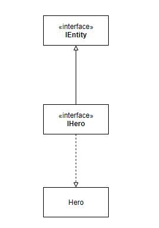

## Detalhamento das Interfaces
### Interface `ISceneManager`

Interface provida por um componente visual que pode ser armazenado e renderizado como `Scene`.

```Java
public interface ISceneManager {
	public void setDisplay(GameWindow main);
	public void setInputSource(KeyManager key, MouseManager mouse);
	public void addScene(String name, Scene cena);
	public void setCurrent(String name) throws SceneManagerException;
    public void update(KeyManager key);
}

```
|Método       |Objetivo            |
|:-----------|:------------------|
|`setDisplay`           |Armazena em uma cena o endereço do display   |
|`setInputSource`             |Determina a fonte do inputs                        |
|`addScene`                |Adiciona uma `Scene`                          |
|`setCurrent`     |Define a `Scene` que será renderizada                       |
|`update`                |Atualiza a `Scene` atual    |

### Interface `IScene`

Interface provida por um componente visual que pode ser armazenado e renderizado como `Scene`.

```Java
public interface IScene {
    public void setCallback(SceneManager sceneMan);
	public void initScene(Assets gameAssets);
	public void update();
    public void setSceneControler(SceneControler sceneCTRL);
	public void render();
}
```
|Método       |Objetivo            |
|:-----------|:------------------|
|`setCallback`           |Armazena em uma cena o endereço de callback do `SceneManager`   |
|`initScene`             |Inicializa os componentes de uma `Scene`                        |
|`update`                |Atualiza os componentes de uma `Scene`                          |
|`setSceneControler`     |Define um `SceneControler` para a `Scene`                       |
|`render`                |Renderiza na tela os componentes de uma `Scene`                 |

### Interface `IDungeon`
Interface provida por Dungeon que organiza as entidades na disposição do tabuleiro. Esta interface é herdeira de IEntity.

```Java
public interface IDungeon extends IEntity {
    public void connectPathfinder(IPathfinder pathFinder);
	public void moveEntity(IEntity ent, int[] target);
	public int[] getPlayerPosition();
	public void setSaida(int x, int y);
	public int[] getSaida();
	public void setJogador(IEntity jogador);
	public boolean isPlayerTurn();
	public void requestNextTurn();
	public void toggleUpdating(boolean value);
	public void handleAttack(IEntity attacker, int[] target);
    public ArrayList<int[]> findPath(int[] source, int[] target);
}
```

|Método     |Objetivo             |
|:---------|:-----------------------|
|`connectPathfinder` |Conecta o Pathfinder                     |
|`moveEntity` |move uma entidade de posição                      |
|`getPlayerPosition` |devolve a posição do jogador                      |
|`getSaida` |devolve a posição de saida da Dungeon                      |
|`PlayerTurnSaida` |Devolve se é turno do jogador                      |
|`requestNextTurn` |recebeSolicitação de troca de turno                      |
|`handleAttack`   |Lida com o ataque de uma entidade a uma posição          |
|`findPath`   |procura o menor caminho para uma posição          |

### Interface `IHero`
Interface provida por Hero que auxilia no gerenciamento de posição e ação do jogador. Esta interface é herdeira de IEntity.

```Java
public interface IHero extends IEntity {
    public void connectControler(HeroControler heroCtrl);
	public void receiveMovement(int pos[]);
	public void attack(int[] target);
	public void passTurn();
	public boolean isAlive();
}
```
|Método    |Objetivo                 |
|:--------|:-----------------------|
|`connectControler`|Conecta o controlador do Heroi                       |
|`receiveMovement`|realiza o movimento do Heroi                          |
|`attack`        |ataca um inimigo a escolha                             |
|`passTunr`      |Passa o turno                                          |
|`isAlive`|Devolve se o heroi esta vivo                                  |

### Interface `IEntity`
Interface provida por Entidade que é essencial para o desenvolvimento das classes as quais realizam o funcionamento do jogo.

```Java
public interface IEntity extends IEntityProperties, IEntityCompositing {
	public void render(Graphics2D g);
	public void update();
	public void updateLife(int n);
	public void interact(IEntity ent);
}
```
|Método      |Objetivo             |
|:----------|:-----------------------|
|`addEntity`      |adiciona uma nova entidade na entidade atual          |
|`removeEntity`   |remove uma entidade na entidade atual`                |
|`setPosition`    |determina a posição da entidade                       |
|`setTexture`     |determina a imagem da entidade                        |
|`setCallback`    |armazena a entidade pai                               |
|`getPosition`    |devolve a posição da entidade                         |
|`render`         |renderiza a imagem                                    |
|`update`         |atualiza a entidade conforme o decorrer do jogo       |

## Plano de Exceções
### SceneManager
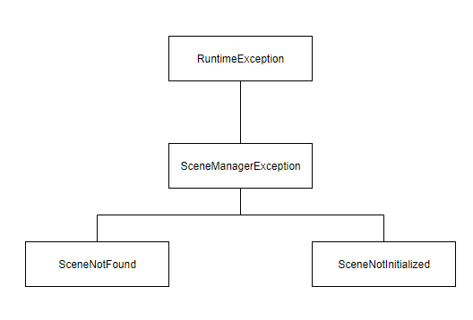

|**Classe**|**Descrição**|
|:---------|:------------|
|`SceneManagerException` |Engloba as exceções do `SceneManager`                          |
|`SceneNotFound`         |Indica que a Scene selecionada não foi encontrada pelo Manager |
|`SceneNotInitialized`   |Indica que a Scene não pode ser renderizada corretamenteos, pois seus componentes não foram inicializados|

### DungeonException
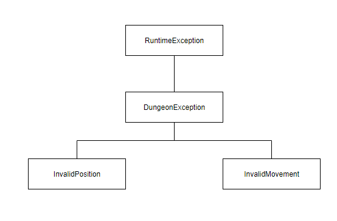

|**Classe**|**Descrição**|
|:---------|:------------|
|`DungeonException`      |Engloba as exceções da `Dungeon`                           |
|`InvalidPosition`       |Indica que a posição da Dungeon é inválida                 |
|`InvalidMovement`       |Indica que o movimento solicitado é inválido               |
