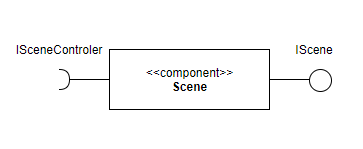
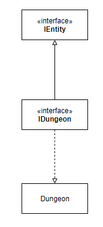

# Projeto `Software Dungeon`

## Estrutura de Arquivos e Pastas
```
├── README.md          <- apresentação do projeto
│
├── data               <- dados usados pelo jogo (se houver)
│
├── notebooks          <- Jupyter notebooks ou equivalentes
│
├── diagramas          <- diagramas usados para apresentação
│
├── src                <- projeto em Java (preferencialmente projeto no Eclipse)
│   │
│   ├── src            <- arquivos-fonte do projeto (.java)
│   │
│   ├── bin            <- arquivos em bytecode (.class)
│   │
│   └── README.md      <- instruções básicas de instalação/execução
│
└── assets             <- mídias usadas no projeto
```
## Descrição do Projeto:
O Projeto Software Dungeon consiste em um Role Playing Game (RPG) de turnos com uma temática relacionada a área de TI. Para isso, buscamos desenvolver um jogo que combine as campanhas épicas dos RPGs com classes e habilidades de personagens relacionados a área de TI.

## Equipe
* `João Miguel de Oliveira Guimarães` - `174358`
* `José Felipe Theodoro` - `219081`

## Vídeos do Projeto
### Vídeo da Prévia
Clique [aqui](https://drive.google.com/file/d/1qhYWc6KVMfF58pXKRRS31AP4sjog4pJ3/view?usp=sharing) para acessar o vídeo da prévia.

## Slides do Projeto
### Slides da Prévia
Clique [aqui](https://docs.google.com/presentation/d/1MpBTCWQWIdH_MCYp_qSrFiiznRZbK0I9ln1lg0OSggU/edit?usp=sharing) para acessar os slides da prévia.

## Documentação dos Componentes
## Diagramas
### Diagrama Geral do Projeto


### Diagrama Geral de Componentes


## Componentes
### `Scene`

O Componente `Scene` é responsável por organizar os conteúdos que serão renderizados na tela em um único componente que pode ser adicionado e removido da janela principal em runtime.



**Ficha Técnica:**
|Item      |Detalhamento             |
|:---------|:------------------------|
|Classe    |`mc322.game.scenes.Scene`|
|Autores   |`nomes`                  |
|Interfaces|`IScene`                 |

**Interfaces:**


### `SceneControler`

O Componente `SceneControler` é responsável por lidar com os inputs do jogador, o que o permite controlar os objetos que constituem uma `Scene`.


**Ficha Técnica:**
|Item      |Detalhamento                             |
|:---------|:----------------------------------------|
|Classe    |`mc322.game.scenes.SceneControler`       |
|Autores   |`nomes`                                  |
|Interfaces|`ISceneControler`                        |

**Interfaces:**


### `Dungeon`


**Ficha Técnica:**
|Item      |Detalhamento                          |
|:---------|:-------------------------------------|
|Classe    |`mc322.game.composites.Dungeon`       |
|Autores   |`nomes`                               |
|Interfaces|`IDungeon`, `IEntity`                 |

**Interfaces**



### `Hero`


**Ficha Técnica:**
|Item      |Detalhamento                       |
|:---------|:----------------------------------|
|Classe    |`mc322.game.composites.Hero`       |
|Autores   |`nomes`                            |
|Interfaces|`IHero`, `IEntity`                 |

**Interfaces**


### `SceneBuilder`

O Componente `SceneBuilder` é responsável por agregar os `Builders` necessários para construir a `Scene`.


**Ficha Técnica:**
|Item      |Detalhamento                            |
|:---------|:---------------------------------------|
|Classe    |`mc322.game.factory.SceneBuilder`       |
|Autores   |`nomes`                                 |
|Interfaces|`ISceneBuilder`                         |

**Interfaces:**


## Detalhamento das Interfaces
### Interface `IScene`

Interface provida por um componente visual que pode ser armazenado e renderizado como `Scene`.

```Java
public interface IScene {
    public void setCallback(SceneManager sceneMan);
	public void initScene(Assets gameAssets);
	public void update();
    public void setSceneControler(SceneControler sceneCTRL);
	public void render();
}
```
|Método       |Objetivo            |
|:-----------|:------------------|
|`setCallback`           |Armazena em uma cena o endereço de callback do `SceneManager`   |
|`initScene`             |Inicializa os componentes de uma `Scene`                        |
|`update`                |Atualiza os componentes de uma `Scene`                          |
|`setSceneControler`     |Define um `SceneControler` para a `Scene`                       |
|`render`                |Renderiza na tela os componentes de uma `Scene`                 |

### Interface `ISceneControler`
Interface provida por um controlador que permite interagir com uma `Scene`.

```Java
public interface ISceneControler {
    public void setDisplay(JFrame main);
    public void addScene(String name, Scene cene);
    public void setCurrent(String name);
    public void setInputSource(KeyManager key, MouseManager mouse);
    public void update();
}
```
|Método       |Objetivo            |
|:-----------|:------------------|
|`setDisplay`            |Define a Janela principal da aplicação                          |
|`addScene`              |Adiciona uma `Scene` ao manager                                 |
|`setCurrent`            |Define a `Scene` que deve ser renderizada                       |
|`setInputSource`        |Define a fonte dos inputs                                       |
|`render`                |Renderiza uma `Scene`                                           |

### Interface `ISceneBuilder`
Interface provida por um `Builder` que permite construir com uma `Scene`.

```Java
public interface ISceneBuilder {
    public EntityBuilder getEntityBuilder();
    public VisualComponentBuilder getVisualComponentBuilder();
}
```
|Método       |Objetivo            |
|:-----------|:------------------|
|`getEntityBuilder`                |Retorna o construtor de entidades para uma `Scene`    |
|`getVisualComponentBuilder`       |Retorna o construtir de cimponentes visuais           |

### Interface `IDungeon`
Interface provida por Dungeon que organiza as entidades na disposição do tabuleiro. Esta interface é herdeira de IEntity.

```Java
public interface IDungeon extends IEntity {
    public void moveEntity(Entity, int[] source, int[] target[]);
    public void findPath(int[] source, int[] target);
}
```
|Método     |Objetivo             |
|:---------|:-----------------------|
|`moveEntity` |move uma entidade de posição                      |
|`findPath`   |procura o menor caminho para uma posição          |
|`setSize`    |determina o tamanho da imagem                     |
|`getSize`    |devolve o tamanho da imagem                       |
|`getTile`    |devolve a célula daquela posição                  |

### Interface `IHero`
Interface provida por Hero que auxilia no gerenciamento de posição e ação do jogador. Esta interface é herdeira de IEntity.

```Java
public interface IHero extends IEntity {
    public void move(int[] source, int[] target);
    public void attack(int[] source, int[] target);
    public void useEspecial(int[] source, int[] target);
}
```
|Método    |Objetivo                 |
|:--------|:-----------------------|
|`attack`        |ataca um inimigo a escolha                                             |
|`movement`      |movimenta o herói aletrando a posição conforme demanda o usuário       |
|`specialAbility`|realiza a habilidade especial do herói                                 |

### Interface `IEntity`
Interface provida por Entidade que é essencial para o desenvolvimento das classes as quais realizam o funcionamento do jogo.

```Java
public interface IEntity {
    public void addEntity(Entity ent);
	public void removeEntity(Entity ent);
	public void setPosition(int x, int y);
	public void setTexture(Sprite sprite);
	public void setCallback(Entity father);
	public int[] getPosition();
	public void render(Graphics2D g);
	public void update(KeyManager key);
}
```
|Método      |Objetivo             |
|:----------|:-----------------------|
|`addEntity`      |adiciona uma nova entidade na entidade atual          |
|`removeEntity`   |remove uma entidade na entidade atual`                |
|`setPosition`    |determina a posição da entidade                       |
|`setTexture`     |determina a imagem da entidade                        |
|`setCallback`    |armazena a entidade pai                               |
|`getPosition`    |devolve a posição da entidade                         |
|`render`         |renderiza a imagem                                    |
|`update`         |atualiza a entidade conforme o decorrer do jogo       |

## Plano de Exceções
### SceneManager


|**Classe**|**Descrição**|
|:---------|:------------|
|`SceneManagerException` |Engloba as exceções do `SceneManager`                          |
|`SceneNotFound`         |Indica que a Scene selecionada não foi encontrada pelo Manager |
|`SceneNotInitialized`   |Indica que a Scene não pode ser renderizada corretamenteos, pois seus componentes não foram inicializados|

### DungeonException


|**Classe**|**Descrição**|
|:---------|:------------|
|`DungeonException`      |Engloba as exceções da `Dungeon`                           |
|`InvalidPosition`       |Indica que a posição da Dungeon é inválida                 |
|`InvalidMovement`       |Indica que o movimento solicitado é inválido               |

### EntityException


|**Classe**|**Descrição**|
|:---------|:------------|
|`EntityException`     |Engloba as exceções das Entitys                                            |
|`CantAddNullEntity`   |Indica que um Composite não pode adicionar uma Entity null a seus filhos   |
|`CantRemoveNullEntity`|Indica que um Composite não pode remover uma Entity null de seus filhos    |
|`NullGraphicsRender`  |Indica que o Objeto Graphics usado para renderização da Entity é null      |
